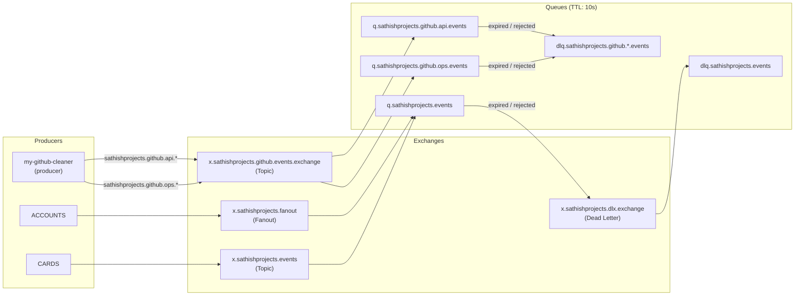

# Jubilant Memory — Spring Cloud Config Server

Centralized configuration repository for a distributed microservice ecosystem built with Spring Boot, Spring Cloud, Netflix Eureka, RabbitMQ, and Kafka. This repo is consumed by ~14 independent Spring Boot services at startup via Spring Cloud Config Server.

**Author:** Sathish Jayapal
**Config Server Port:** 8888
**Last Updated:** February 2026

---

## Table of Contents

- [Architecture](#architecture)
- [Services Catalog](#services-catalog)
- [Tech Stack](#tech-stack)
- [Infrastructure](#infrastructure)
- [Local Development](#local-development)
- [Configuration Profiles](#configuration-profiles)
- [Monitoring](#monitoring)

---

## Architecture

### System Overview

```mermaid
graph TB
    subgraph infra["Service Infrastructure"]
        CONFIG["Spring Cloud Config Server\n:8888\nGit-backed · RSA encrypted secrets\n(this repository)"]
        EUREKA["Netflix Eureka Server\n:8070\nService Registry & Discovery"]
    end

    subgraph financial["Financial Services  (Java 18)"]
        ACCOUNTS["accounts\n• Account management\n• PostgreSQL"]
        CARDS["cards  :8080\n• Payment card mgmt\n• PostgreSQL"]
        LOANS["loans  :8090\n• Loan management\n• PostgreSQL"]
    end

    subgraph fitness["Fitness & Running Services  (Java 21)"]
        TRACKGARMIN["trackgarmin\n• Garmin Connect sync\n• PostgreSQL (runs_schema)\n• Virtual threads"]
        TRACKSTRAVA["trackstrava  :9032\n• Strava OAuth2 import\n• PostgreSQL (runs_schema)"]
        GARMININT["garmindatainitializer\n• CSV → DB seeder\n• ShedLock (every 30s)"]
        STRAVAPRODUCER["sathishstrava-data-producer  :8065\n• Strava event producer\n• Eureka client"]
    end

    subgraph support["Support Services"]
        EVTSVC["event-service\n• Event logging\n• PostgreSQL"]
        GOTOAWS["gotoaws-sathish  :9082\n• AWS-bound service\n• MongoDB · Mongock"]
        GITHUBCLEAN["my-github-cleaner\n• GitHub repo cleanup\n• RabbitMQ consumer/producer"]
        COMMON["sathishruns-common\n• Shared DTOs · retry logic\n• Kafka Avro producer"]
    end

    subgraph messaging["Messaging Infrastructure  (Docker Compose)"]
        RABBITMQ(["RabbitMQ  :5672 / :15672\n• x.sathishprojects.fanout\n• x.sathishprojects.events\n• DLX / DLQ support"])
        KAFKA(["Kafka 3-node cluster\n• :19092  :29092  :39092\n• Schema Registry  :8081\n• Topic prefix: app-*"])
    end

    subgraph dbs["Data Stores  (Docker Compose)"]
        PG_FIN[("PostgreSQL 17\n:5440\naccounts · cards · loans")]
        PG_RUN[("PostgreSQL 17\n:5441  /  :5442\nmytracker · runs-app\nruns_schema")]
        PG_EVT[("PostgreSQL 17\n:6433\nevent-service")]
        MONGO[("MongoDB 8\n:27017\ngotoaws-sathish\nreplica set")]
    end

    subgraph k8s["Kubernetes  (sathishproject namespace)"]
        K8S_CFG["Config Server Pod\n3 replicas · LoadBalancer :8888"]
        K8S_PG["PostgreSQL\nClusterIP service"]
    end

    CONFIG -->|"serves YAML config on startup"| ACCOUNTS
    CONFIG -->|"serves YAML config on startup"| CARDS
    CONFIG -->|"serves YAML config on startup"| LOANS
    CONFIG -->|"serves YAML config on startup"| TRACKGARMIN
    CONFIG -->|"serves YAML config on startup"| TRACKSTRAVA
    CONFIG -->|"serves YAML config on startup"| GARMININT
    CONFIG -->|"serves YAML config on startup"| STRAVAPRODUCER
    CONFIG -->|"serves YAML config on startup"| EVTSVC
    CONFIG -->|"serves YAML config on startup"| GOTOAWS

    EUREKA <-->|"register · heartbeat · discover"| ACCOUNTS
    EUREKA <-->|"register · heartbeat · discover"| CARDS
    EUREKA <-->|"register · heartbeat · discover"| LOANS
    EUREKA <-->|"register · heartbeat · discover"| TRACKGARMIN
    EUREKA <-->|"register · heartbeat · discover"| STRAVAPRODUCER

    ACCOUNTS --> PG_FIN
    CARDS --> PG_FIN
    LOANS --> PG_FIN
    TRACKGARMIN --> PG_RUN
    TRACKSTRAVA --> PG_RUN
    EVTSVC --> PG_EVT
    GOTOAWS --> MONGO

    ACCOUNTS -->|"publish events"| RABBITMQ
    CARDS -->|"publish events"| RABBITMQ
    GITHUBCLEAN <-->|"produce/consume"| RABBITMQ
    STRAVAPRODUCER -->|"produce Avro"| KAFKA
    COMMON -->|"produce Avro"| KAFKA

    CONFIG --> K8S_CFG
    K8S_PG --> PG_FIN
```



### Message Flow: RabbitMQ Topology



### Key Architectural Decisions

| Decision | Choice | Why |
|----------|--------|-----|
| Config strategy | Spring Cloud Config Server (Git-backed) | Single source of truth; profile-aware; encrypted secrets; no redeploy to change config |
| Service discovery | Netflix Eureka | Mature, Spring-native; dynamic service registration without hardcoded URLs |
| Dual messaging | RabbitMQ + Kafka | RabbitMQ for low-volume app events; Kafka for high-throughput Strava/Garmin data streams with Avro schema |
| Multi-DB strategy | PostgreSQL (per-domain) + MongoDB | Relational for financial/fitness; MongoDB for schema-flexible AWS-bound service |
| Distributed locking | ShedLock (JDBC) | Prevents duplicate Garmin seeding jobs across instances without Quartz overhead |
| Container orchestration | Kubernetes (3-replica config server) | HA config serving; LoadBalancer exposes single stable endpoint to all services |

> Full architecture decision records: [`docs/adr/`](docs/adr/)

---

## Services Catalog

| Service | Port | Database | Messaging | Notes |
|---------|------|----------|-----------|-------|
| Config Server | 8888 | — | — | Git-backed, RSA encrypted props |
| Eureka Server | 8070 | — | — | Service registry |
| accounts | dynamic | PostgreSQL :5440 | RabbitMQ | Java 18, account management |
| cards | 8080 | PostgreSQL :5440 | RabbitMQ | Payment card management |
| loans | 8090 | PostgreSQL :5440 | RabbitMQ | Loan management |
| trackgarmin | dynamic | PostgreSQL :5441 (runs_schema) | RabbitMQ | Virtual threads, Garmin sync |
| trackstrava | 9032 | PostgreSQL :5441 (runs_schema) | RabbitMQ | Strava OAuth2 |
| garmindatainitializer | dynamic | PostgreSQL :5441 | — | CSV seeder, ShedLock every 30s |
| sathishstrava-data-producer | 8065 | — | Kafka | Avro serialized events |
| event-service | dynamic | PostgreSQL :6433 | — | Event logging |
| gotoaws-sathish | 9082 | MongoDB :27017 | — | Mongock migrations |
| my-github-cleaner | dynamic | — | RabbitMQ (DLQ) | GitHub repo cleanup |
| sathishruns-common | — | — | Kafka (Avro) | Shared library |

---

## Tech Stack

| Layer | Technology |
|-------|-----------|
| Language | Java 18 / 21 |
| Framework | Spring Boot 3.x / 4.x |
| Service Discovery | Netflix Eureka :8070 |
| Config Server | Spring Cloud Config :8888 |
| Primary DB | PostgreSQL 17 |
| NoSQL DB | MongoDB 8 (replica set) |
| Messaging | RabbitMQ 4.1 + Kafka 3-node |
| Schema Registry | Confluent Schema Registry :8081 |
| Serialization | Avro (Kafka) · JSON (RabbitMQ) |
| DB Migrations | Flyway (PostgreSQL) · Mongock (MongoDB) |
| Distributed Locking | ShedLock (JDBC) |
| Orchestration | Kubernetes (sathishproject namespace) |
| CI/CD | Azure Pipelines |
| Container Images | docker.io/travelhelper0h/sathishproject-* |

---

## Infrastructure

Start all infrastructure locally (PostgreSQL instances, RabbitMQ, MongoDB):

```bash
cd config
docker compose up -d
```

Services started:

| Container | Port | Purpose |
|-----------|------|---------|
| PostgreSQL 17 | 6433 | event-service DB |
| PostgreSQL 17 | 5440 | mytracker DB |
| PostgreSQL 17 | 5441 | shedlock DB |
| PostgreSQL 17 | 5442 | runs-app DB |
| RabbitMQ 4.1 | 5672 / 15672 | Messaging + Management UI |
| MongoDB 8 | 27017 | gotoaws-sathish (replica set) |

---

## Local Development

**Start-up order matters:**

```bash
# 1. Infrastructure
cd config && docker compose up -d

# 2. Config Server (this repo is pulled by it)
#    Run from sathishproject-config-server repo
./mvnw spring-boot:run

# 3. Eureka Server
cd eurekaserver && ./mvnw spring-boot:run

# 4. Any microservice (config + eureka must be up first)
cd accounts && ./mvnw spring-boot:run
```

---

## Configuration Profiles

Each service has profile-specific YAML files in this repo:

| Profile | Purpose |
|---------|---------|
| `default` | Local development (localhost, H2 or local PostgreSQL) |
| `-local` | Extended local config with real DBs |
| `-azure` | Azure PostgreSQL connection strings |
| `-heroku` | Heroku deployment (env var-driven) |
| `-prod` | Production (encrypted secrets, secure SSL) |

Secrets are RSA-encrypted using Spring Cloud Config's cipher support. Encrypted values use the `{cipher}` prefix.

---

## Monitoring

| Endpoint | URL | Notes |
|----------|-----|-------|
| Config Server health | http://localhost:8888/actuator/health | |
| Eureka Dashboard | http://localhost:8070 | Registered services |
| RabbitMQ Management | http://localhost:15672 | guest/guest (local) |
| Service health | http://localhost:{port}/actuator/health | Per service |
| Prometheus metrics | http://localhost:8070/actuator/prometheus | Eureka server |

---

**Author:** Sathish Jayapal
**Last Updated:** February 2026
